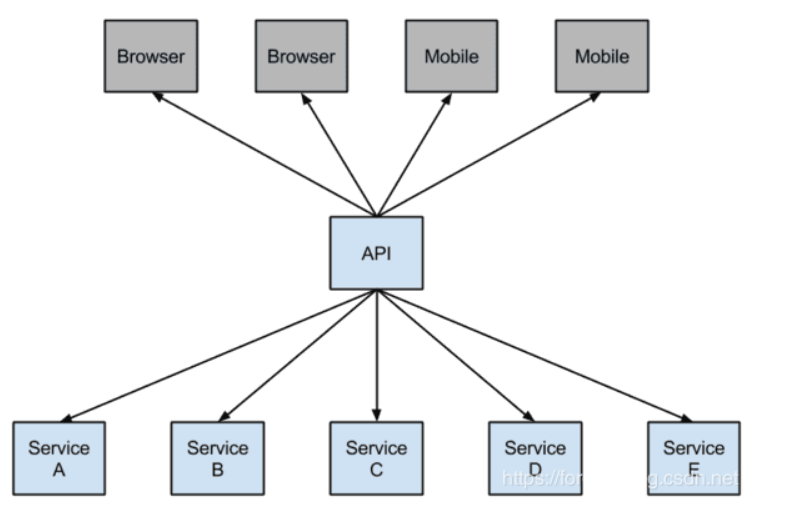
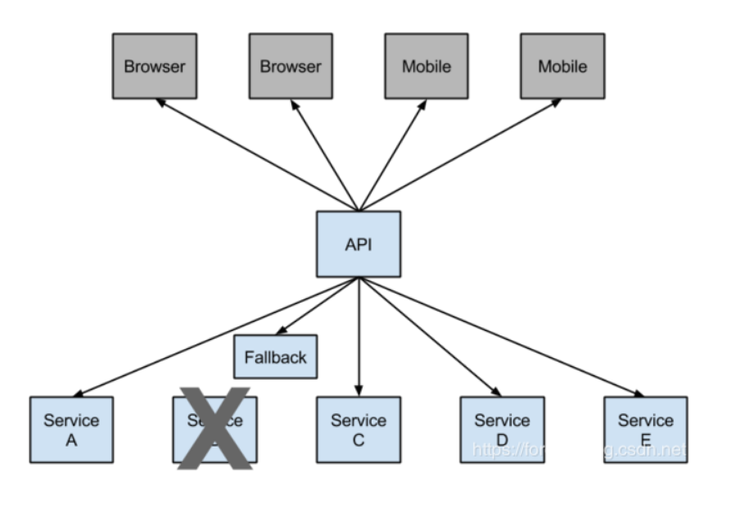

###一、spring cloud简介
鉴于《史上最简单的Spring Cloud教程》很受读者欢迎，再次我特意升级了一下版本，目前支持的版本为Spring Boot版本2.0.3.RELEASE,Spring Cloud版本为Finchley.RELEASE。

Finchley版本的官方文档如下：
http://cloud.spring.io/spring-cloud-static/Finchley.RELEASE/single/spring-cloud.html

spring cloud 为开发人员提供了快速构建分布式系统的一些工具，包括配置管理、服务发现、断路器、路由、微代理、事件总线、全局锁、决策竞选、分布式会话等等。它运行环境简单，可以在开发人员的电脑上跑。另外说明spring cloud是基于springboot的，所以需要开发中对springboot有一定的了解。另外对于“微服务架构” 不了解的话，可以通过搜索引擎搜索“微服务架构”了解下。

###二、ribbon简介
ribbon是一个负载均衡客户端，可以很好的控制htt和tcp的一些行为。Feign默认集成了ribbon。

ribbon 已经默认实现了这些配置bean：

IClientConfig ribbonClientConfig: DefaultClientConfigImpl

1、IRule ribbonRule: ZoneAvoidanceRule

2、IPing ribbonPing: NoOpPing

3、ServerList ribbonServerList: ConfigurationBasedServerList

4、ServerListFilter ribbonServerListFilter: ZonePreferenceServerListFilter

5、ILoadBalancer ribbonLoadBalancer: ZoneAwareLoadBalancer

###三、Feign简介
Feign是一个声明式的伪Http客户端，它使得写Http客户端变得更简单。使用Feign，只需要创建一个接口并注解。它具有可插拔的注解特性，可使用Feign 注解和JAX-RS注解。Feign支持可插拔的编码器和解码器。Feign默认集成了Ribbon，并和Eureka结合，默认实现了负载均衡的效果。

简而言之：

Feign 采用的是基于接口的注解

Feign 整合了ribbon，具有负载均衡的能力

整合了Hystrix，具有熔断的能力

###四、断路器简介
在微服务架构中，根据业务来拆分成一个个的服务，服务与服务之间可以相互调用（RPC），在Spring Cloud可以用RestTemplate+Ribbon和Feign来调用。为了保证其高可用，单个服务通常会集群部署。由于网络原因或者自身的原因，服务并不能保证100%可用，如果单个服务出现问题，调用这个服务就会出现线程阻塞，此时若有大量的请求涌入，Servlet容器的线程资源会被消耗完毕，导致服务瘫痪。服务与服务之间的依赖性，故障会传播，会对整个微服务系统造成灾难性的严重后果，这就是服务故障的“雪崩”效应。

为了解决这个问题，业界提出了断路器模型
Netflix开源了Hystrix组件，实现了断路器模式，SpringCloud对这一组件进行了整合。 在微服务架构中，一个请求需要调用多个服务是非常常见的，如下图：

较底层的服务如果出现故障，会导致连锁故障。当对特定的服务的调用的不可用达到一个阀值（Hystric 是5秒20次） 断路器将会被打开。断路打开后，可用避免连锁故障，fallback方法可以直接返回一个固定值。

###五、Zuul简介
Zuul的主要功能是路由转发和过滤器。路由功能是微服务的一部分，比如／api/user转发到到user服务，/api/shop转发到到shop服务。zuul默认和Ribbon结合实现了负载均衡的功能。

zuul有以下功能：

Authentication

Insights

Stress Testing

Canary Testing

Dynamic Routing

Service Migration

Load Shedding

Security

Static Response handling

Active/Active traffic management
